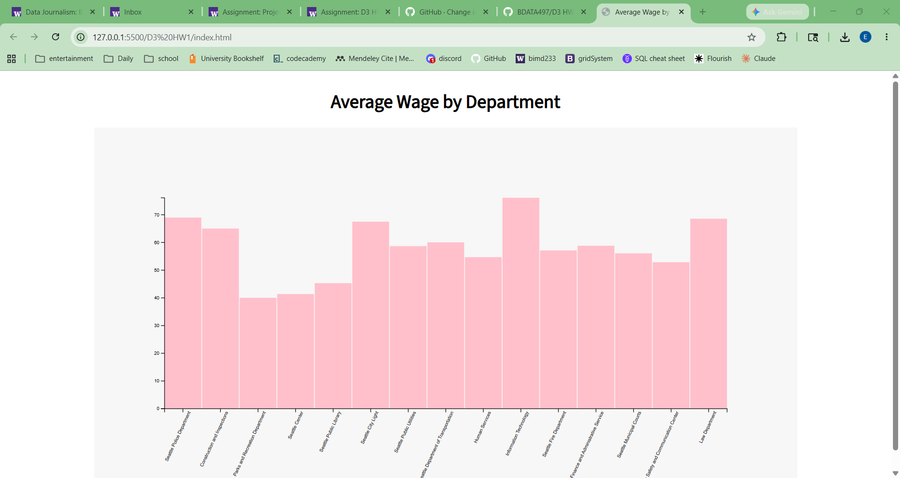

# D3 Homework 1

This project is a D3 bar chart showing the average wage by department in the City of Seattle.

The original dataset came from the City of Seattle Wage Data dataset. I cleaned the data to calculate and display average wages for each department.

Dataset source:
https://data.seattle.gov/City-Administration/City-of-Seattle-Wage-Data/2khk-5ukd/about_data

## Files
- index.html
- main.js
- style.css
- DepAvgWage.csv

## Visualization

