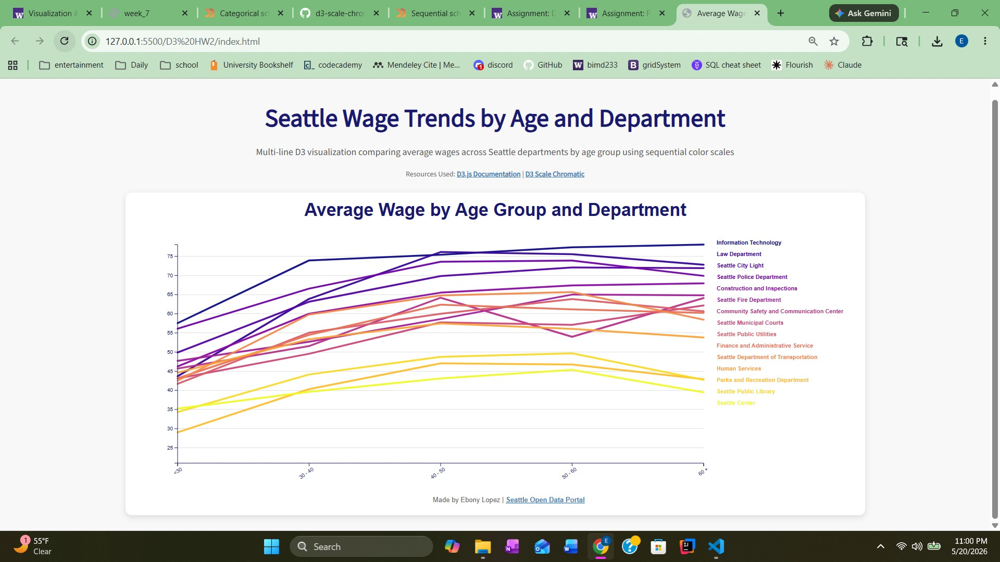

# Seattle Wage Trends by Age and Department

## Overview
This project is a multi-line D3.js visualization comparing average wages across Seattle departments by age group. Each line represents a different department, while the x-axis shows age groups and the y-axis shows average wages. The visualization uses a sequential D3 color scale (`interpolatePlasma`) and SVG styling techniques learned in class.

## Visualization

## Files Included
- `index.html`
- `main.js`
- `style.css`
- `AgeGenderWage.csv`
- `D3HW2.jpg`

## Features
- Multi-line chart using `d3.line()`
- External CSV data loading
- Sequential D3 color scales
- SVG text and labels
- Grid lines
- Styled axes and legend labels
- Responsive SVG layout

## Future Improvements
One improvement I could make is reducing the overlap between the lines, especially near the end of the chart where several departments have similar wages for the `60 +` age group. This makes some areas more difficult to read because many of the labels and lines are close together.

In the future, I could separate the departments into multiple smaller charts instead of placing every department into one visualization. Creating small multiples or grouped charts would make the data easier to compare without so much visual clutter. This would also allow labels to be more readable and give each department more space.

Another improvement would be making the visualization more visually pleasing overall. I could continue experimenting with spacing, typography, color palettes, and line styling to create a cleaner design. Adding interactive features like hover effects or tooltips could also improve readability by letting users focus on one department at a time instead of viewing every label at once.

## Data Source
Seattle Open Data Portal Wage Dataset:  
https://data.seattle.gov/City-Administration/City-of-Seattle-Wage-Data/2khk-5ukd/about_data

## Resources Used
- D3.js Documentation: https://d3js.org/
- D3 Scale Chromatic: https://d3js.org/d3-scale-chromatic

## Author
Made by Ebony Lopez
