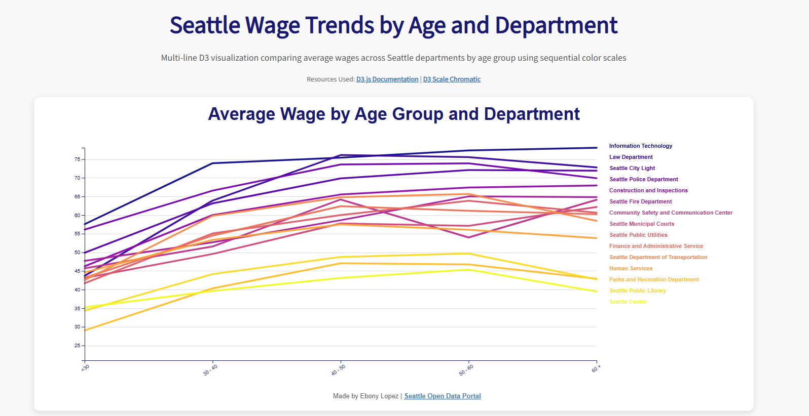
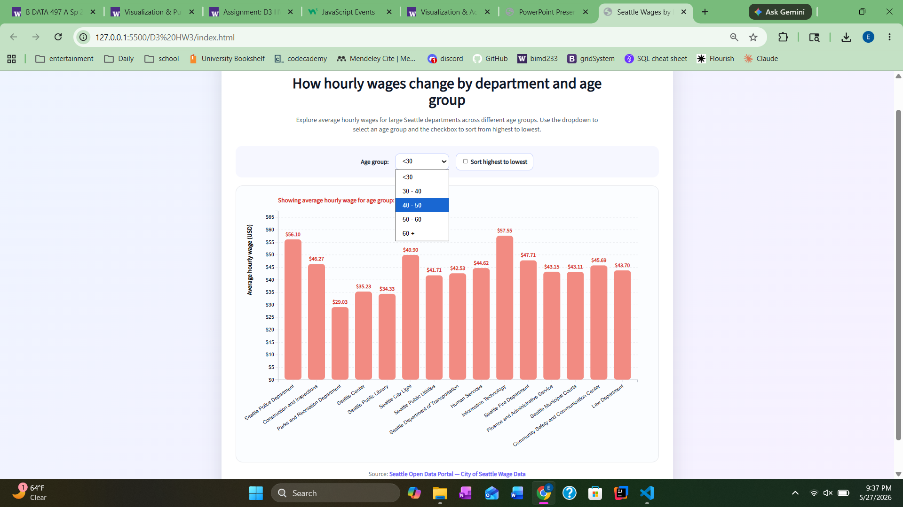

# D3 HW3: Seattle Wage Data Interactive Visualization

**Author:** Ebony Lopez

---

## Overview

An interactive bar chart built with D3.js that visualizes average hourly wages across Seattle city departments, broken down by age group. The visualization emphasizes interaction design, featuring animated transitions, hover tooltips, dynamic sorting, and color changes that respond to the selected age category.

The goal is to explore how wages vary across departments and demographics while practicing D3 interaction and transition patterns in depth.

---

## Features

| Feature | Description |
|---|---|
| External Data | CSV loaded dynamically via D3 |
| Dropdown | Switch between age group categories |
| Sort Toggle | Checkbox to sort bars by wage (high to low) |
| Transitions | Smooth animated bar updates on interaction |
| Hover Tooltip | Contextual data on mouse-over |
| Dynamic Color | Chart color updates per selected age group |
| Responsive Layout | SVG chart scales within the page layout |

---

## Screenshots

### 1 · Initial Chart

The default view on page load, showing the `< 30` age group.

---

### 2 · Transition / Data Update

After selecting a different age group from the dropdown, bars animate smoothly to reflect the new data.

.png)

---

### 3 · Hover Tooltip

Hovering over a bar highlights it and displays a tooltip with the department name and wage value.

.png)

---

### 4 · Sorting

Checking the sort box reorders bars from highest to lowest wage with an animated transition.

.png)

---

### 5 · Dropdown Menu

The dropdown in action, selecting a new age category triggers a full chart update.

---

## Data Source

**Seattle Open Data Portal: City of Seattle Wage Data**
[data.seattle.gov/City-Administration/City-of-Seattle-Wage-Data](https://data.seattle.gov/City-Administration/City-of-Seattle-Wage-Data/2khk-5ukd/about_data)

---

## References

| Resource | Link |
|---|---|
| D3.js Documentation | [d3js.org](https://d3js.org/) |
| D3 Transitions | [d3js.org/d3-transition](https://d3js.org/d3-transition) |
| D3 Array Methods | [d3js.org/d3-array](https://d3js.org/d3-array) |
| D3 Interaction Examples | [d3indepth.com/interaction](https://www.d3indepth.com/interaction/) |
| Tooltip Reference | [d3-graph-gallery.com](https://d3-graph-gallery.com/graph/interactivity_tooltip.html) |
| JavaScript Events | [w3schools.com](https://www.w3schools.com/js/js_events.asp) |
| HTML Input Tag | [w3schools.com](https://www.w3schools.com/tags/tag_input.asp) |