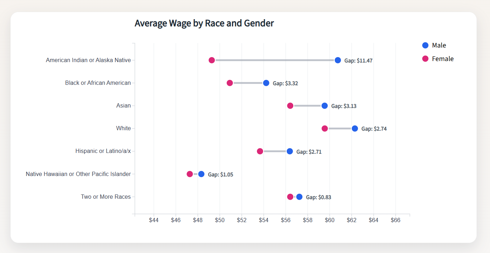
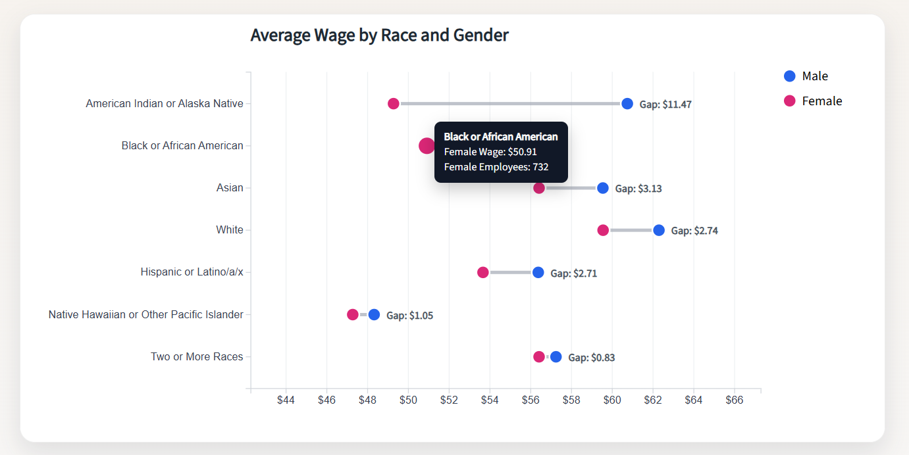

# D3 Homework 3: Narrative Visualization

## Seattle Wage Gaps by Race and Gender

This visualization uses a dumbbell chart to compare the average hourly wages of male and female City of Seattle employees across different racial groups. The goal of the visualization is to make gender wage gaps easier to see within each race category rather than relying on a single overall average.

The blue circles represent average male wages and the pink circles represent average female wages. The gray line connecting the circles highlights the size of the wage gap, while the label displays the exact difference in average wages. Users can hover over each point to view the average wage and the number of employees represented in that group.

This visualization focuses on the narrative that wage gaps are not uniform across all racial groups. Some groups show relatively small differences while others show much larger gaps.

---

## Visualization

### Initial Chart

### Interaction Example

Hovering over a point displays additional information including:

- Race category
- Average wage
- Number of employees represented

---

## Key Findings

- American Indian or Alaska Native employees show the largest wage gap, with men earning approximately $11.47 more per hour on average.
- Black or African American employees show the second largest wage gap at approximately $3.32 per hour.
- Two or More Races shows the smallest wage gap at approximately $0.83 per hour.
- Wage gaps exist across every racial category shown in the dataset.

---

## Design Choices

I chose a dumbbell chart because it is effective for comparing two values within a category. Compared to a bar chart, the distance between the points makes the wage gap easier to see immediately.

Additional design choices include:

- Blue for male wages and pink for female wages
- Gray connecting lines to emphasize the gap
- Hover interactions to provide exact values and employee counts
- Narrative text explaining why the visualization matters
- Clean styling with gridlines and annotations to improve readability

---

## Files Included

- `index.html`
- `main.js`
- `style.css`
- `RaceVGender.csv`
- `DumbellChart.png`
- `DumbellChartInteraction.png`
- `README.md`

---

## Data Source

City of Seattle Wage Data

https://data.seattle.gov/City-Administration/City-of-Seattle-Wage-Data/2khk-5ukd

---

## External Resources

- D3.js Documentation: https://d3js.org/
- D3 Graph Gallery Dumbbell Chart Examples: https://d3-graph-gallery.com/
- Source Sans 3 Font: https://fonts.google.com/specimen/Source+Sans+3

---

Created by Ebony Lopez using D3.js v7.