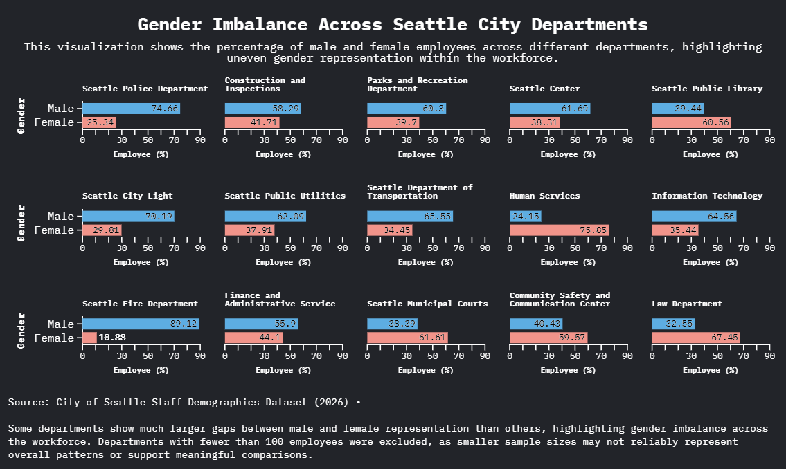
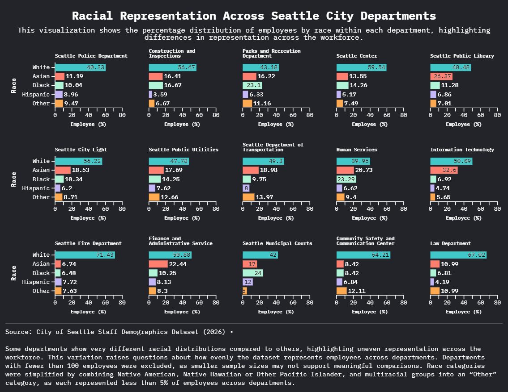
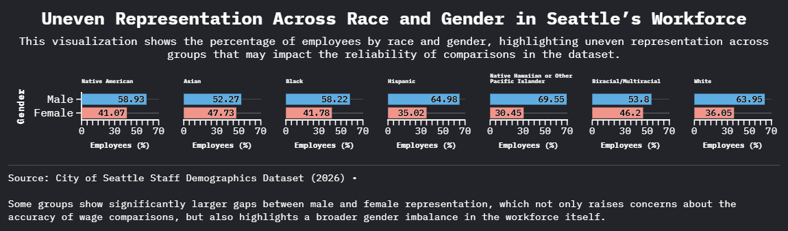

# Seattle Workforce Representation Analysis  
This project analyzes patterns in the City of Seattle Staff Demographics dataset (2026) using visualizations created in Flourish. Instead of only showing the data, these charts focus on evaluating how well the dataset represents employees across race, gender, and departments. The goal is to highlight patterns in representation and consider the limitations of the dataset when making comparisons.

## Visualizations 
**Gender Imbalance Across Seattle City Departments**   
  
This visualization shows the percentage of male and female employees within each department. It highlights that some departments have much larger gender gaps than others, suggesting uneven gender representation across the workforce. These differences raise questions about how balanced the workforce is across departments and how that might affect interpretation of other comparisons.  
**Racial Representation Across Seattle City Departments**   
 
This chart shows the percentage distribution of employees by race within each department. It demonstrates that racial representation varies across departments, with some departments being dominated by one group and others showing more diversity. This variation suggests that the dataset may not evenly represent all groups across the workforce.  
**Uneven Representation Across Race and Gender in Seattle’s Workforce**  
  
This visualization compares male and female representation across different racial groups. It shows that gender gaps are not consistent across races, and some groups have significantly larger imbalances. This raises concerns about how reliable comparisons are when representation is uneven.  
## Data Cleaning and Preparation  
The dataset was cleaned and prepared in Excel before creating the visualizations. I first calculated the count of employees in each category, including race, gender, and department. Using those counts, I calculated averages and percentages for each grouping. 

**For each visualization:**  
Gender vs Race: calculated the percentage of male versus female within each racial group 
Race vs Department: calculated the percentage of each race within each department 
Gender vs Department: calculated the percentage of male versus female within each department  

Additional data decisions were made to improve clarity and reliability. Departments with fewer than 100 employees were excluded because smaller sample sizes may not support meaningful comparisons. Race categories were also simplified by combining Native American, Native Hawaiian or Other Pacific Islander, and multiracial groups into an “Other” category, since each represented less than 5% of employees across departments.  

### Interactive Visualizations 
[View Gender Imbalance Visualization](https://public.flourish.studio/visualisation/28621800)  
[View Racial Imbalance Visualization](https://public.flourish.studio/visualisation/28621861)  
[View Race and Gender Representation Visualization](https://public.flourish.studio/visualisation/28620858/)   

## Data Source

City of Seattle Staff Demographics Dataset (2026).  
Seattle Open Data Portal: https://data.seattle.gov/City-Administration/City-of-Seattle-Wage-Data/2khk-5ukd/about_data  
[Cleaned Dataset](CityOfSeattleWageData.xlsx)   

### Notes  
Values in the charts represent percentages of employees within each category. Uneven group sizes and differences in representation may affect how reliable comparisons are across groups. The decisions to exclude smaller departments and combine smaller racial categories were made to improve readability, but they may also influence how the data is interpreted.
